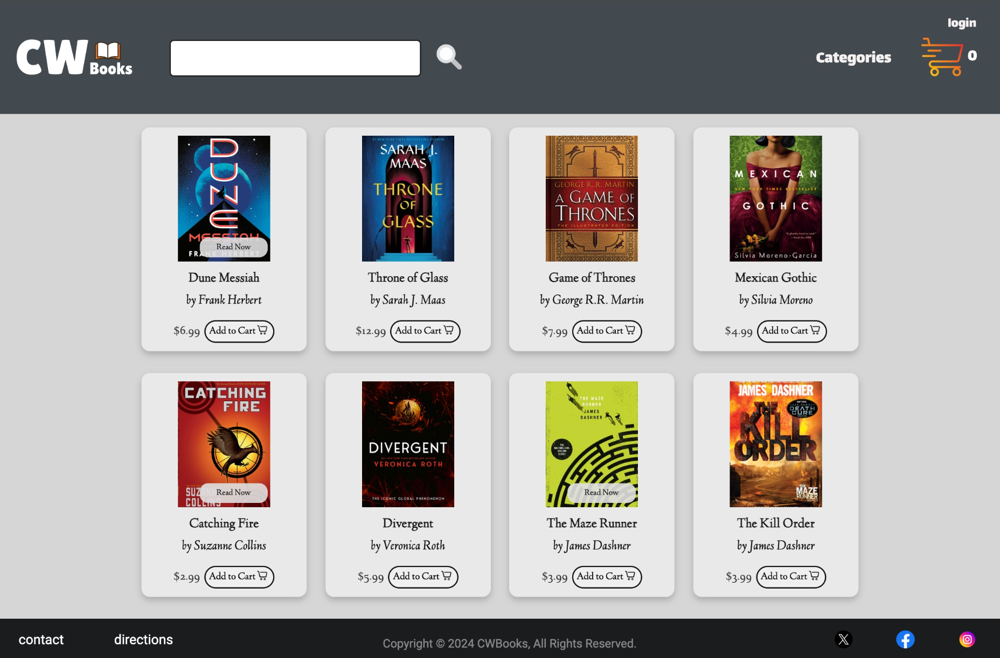

# Full-Stack E-commerce Shopping Platform

## Overview
A responsive and interactive full-stack bookstore shopping application built with modern web technologies.

## Technologies Used
- **Frontend:** React.js, HTML/CSS
- **Backend:** TypeScript, Tomcat server
- **Database:** MySQL, JDBC, DAO patterns
- **API Integration:** RESTful APIs

## Features

### Frontend
- Developed a Single Page Application (SPA) using React.js for enhanced interactivity and responsiveness.
- Designed with HTML/CSS to deliver a clean and user-friendly interface.

### Backend
- Implemented backend logic in TypeScript running on a Tomcat server.
- Used Data Access Object (DAO) patterns and JDBC for robust database interactions.

### Shopping Cart
- Built real-time shopping cart functionality with seamless frontend and backend communication via RESTful APIs.

## Demo

## Project Timeline
- **Duration:** August 2024 - December 2024

